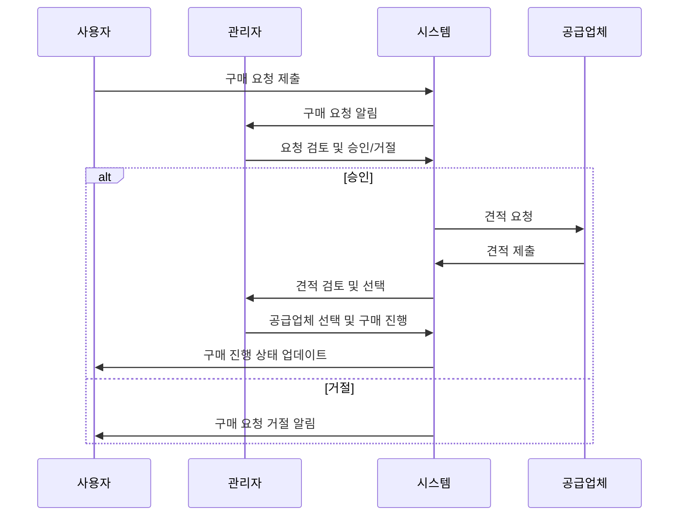
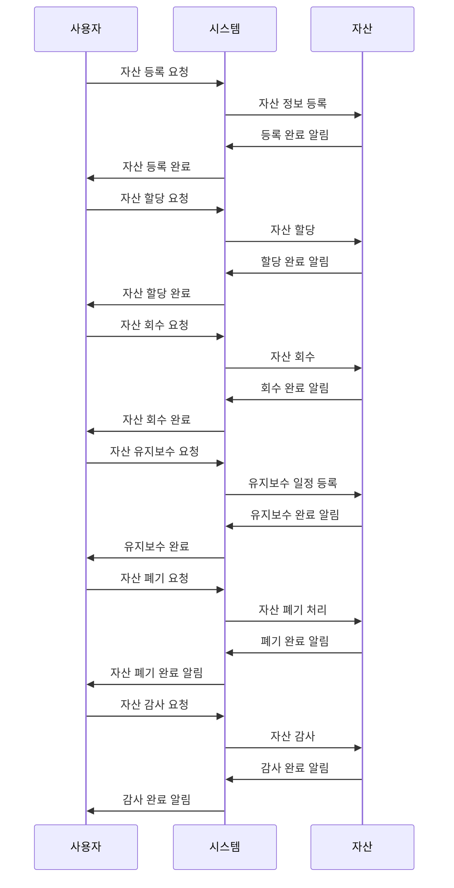
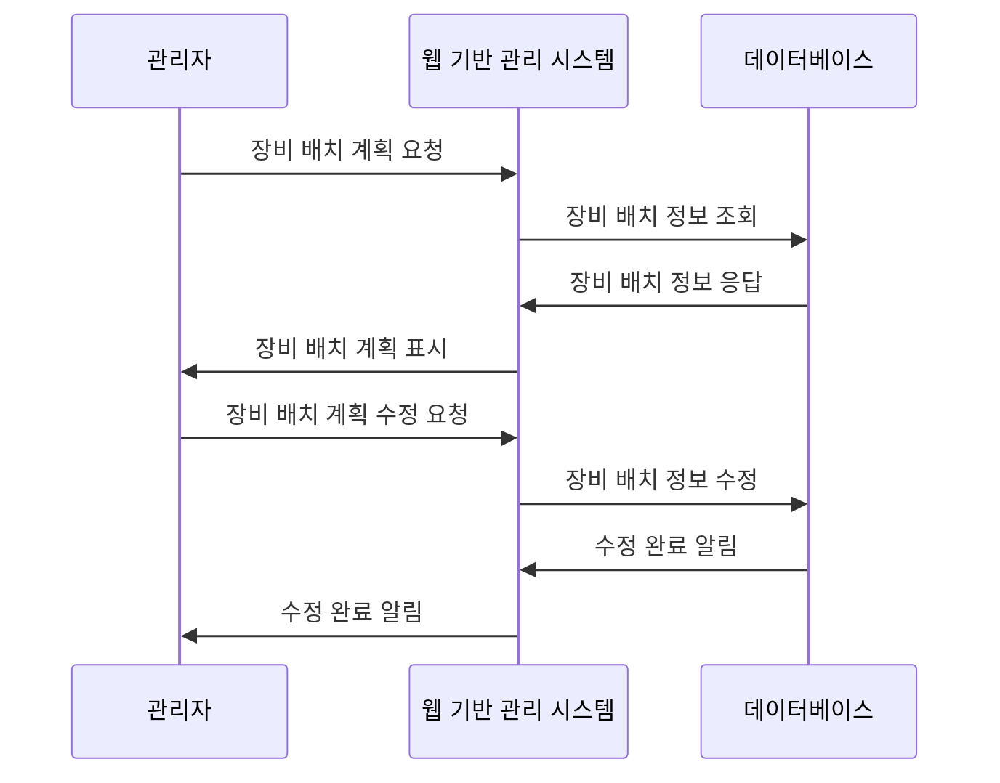
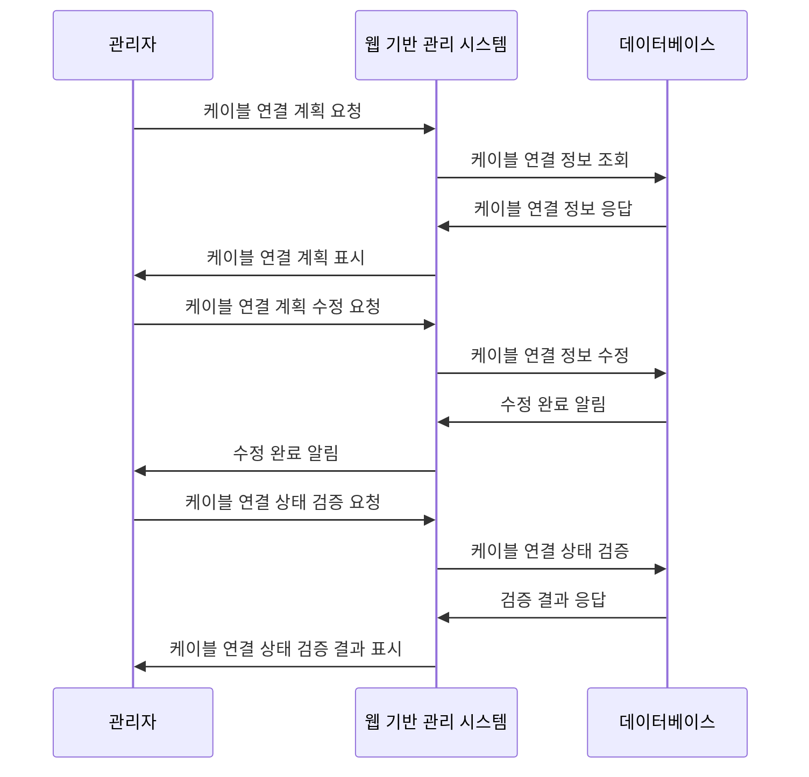
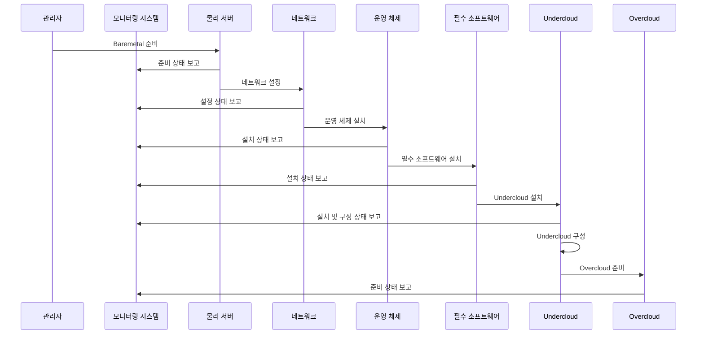
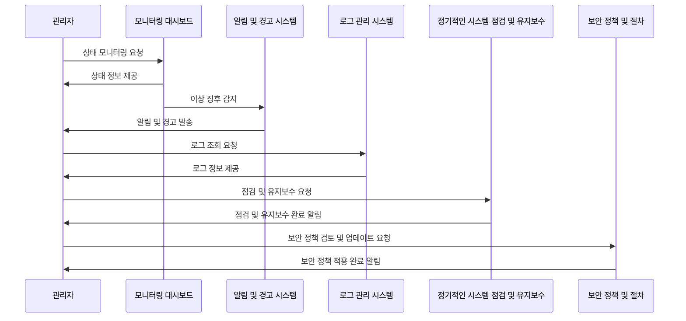
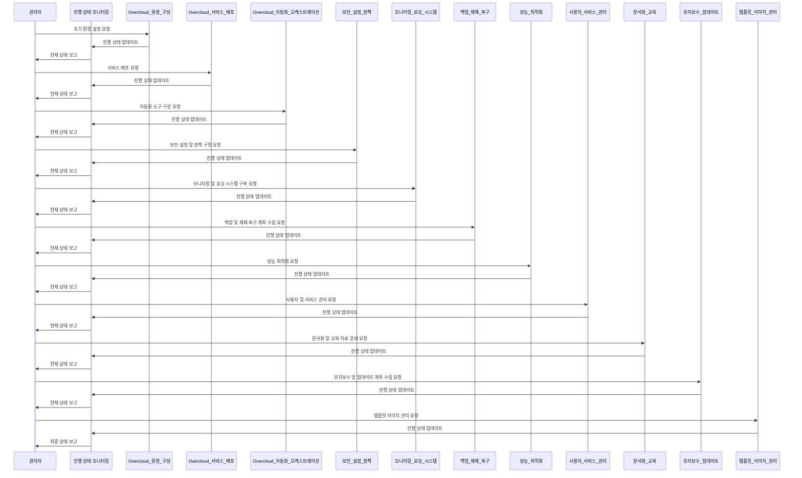

# 웹기반 관리 추적 플랫폼 기능명세

클라우드 컴퓨팅 구축 과정을 효율적으로 관리하고 추적하기 위한 웹기반 플랫폼을 개발할 때 고려해야 할 기능명세는 다음과 같습니다.

## 1. 설계

- **설계 문서 관리**: 클라우드 인프라 설계 문서를 업로드하고 버전 관리할 수 있는 기능.
- **설계 검토 및 승인 프로세스**: 설계 문서에 대한 검토 및 승인 프로세스를 관리할 수 있는 워크플로우 기능.

## 2. 구매

1. **구매 요청 관리**: 하드웨어 및 소프트웨어 구매 요청을 관리하고 추적할 수 있는 기능.
2. **구매 요청 접수**: 사용자가 필요한 하드웨어 및 소프트웨어에 대한 구매 요청을 제출할 수 있는 인터페이스를 제공합니다.
3. **요청 검토 및 승인**: 관리자는 제출된 구매 요청을 검토하고 승인하거나 거절할 수 있습니다. 승인 과정에서 추가 정보 요청이나 수정 요청을 할 수 있습니다.
4. **예산 관리**: 각 구매 요청에 대한 예산을 설정하고, 전체 예산 대비 사용된 예산의 비율을 추적할 수 있습니다.
5. **공급업체 견적 요청**: 승인된 구매 요청에 대해 여러 공급업체에 견적을 요청하고, 견적을 비교하여 최적의 공급업체를 선택할 수 있습니다.
6. **구매 진행 상태 추적**: 구매 요청의 진행 상태(예: 요청, 승인, 주문, 배송, 완료)를 추적하고 관리할 수 있습니다.
7. **구매 이력 관리**: 과거의 구매 요청 및 구매 이력을 검토하고 관리할 수 있습니다. 이를 통해 재구매 시 참고하거나 예산 계획 시 활용할 수 있습니다.
8. **보고서 및 분석**: 구매 관련 데이터를 기반으로 한 보고서 및 분석 기능을 제공하여, 구매 효율성, 공급업체 성능, 예산 사용 현황 등을 평가할 수 있습니다.
9. **공급업체 관리**: 공급업체 정보 및 구매 이력을 관리할 수 있는 기능.

## 3. 자산관리

- **자산 목록 관리**: 클라우드 인프라에 포함된 모든 자산의 목록을 관리할 수 있는 기능.
- **자산 상태 추적**: 자산의 상태(사용 중, 유지보수 중, 폐기 등)를 추적할 수 있는 기능.

1. **자산 등록**: 새로운 자산이 클라우드 인프라에 추가될 때, 해당 자산의 정보(모델명, 시리얼 번호, 구매 날짜 등)를 시스템에 등록합니다.
2. **자산 분류**: 등록된 자산을 용도(서버, 스토리지, 네트워크 장비 등), 위치(데이터센터 내 위치), 상태(사용 중, 유지보수 중, 폐기 예정 등)에 따라 분류합니다.
3. **자산 할당 및 회수**: 자산을 특정 작업이나 직원에 할당하고, 사용이 끝난 후에는 시스템을 통해 자산을 회수합니다. 이 과정을 통해 자산의 사용 현황을 추적할 수 있습니다.
4. **자산 유지보수**: 자산의 정기적인 유지보수 일정을 관리하고, 유지보수가 필요한 자산에 대한 알림을 제공합니다. 유지보수 이력도 함께 관리됩니다.
5. **자산 폐기**: 사용이 끝난 자산이나 수명이 다한 자산에 대해 폐기 절차를 진행합니다. 폐기 전에 모든 데이터를 안전하게 삭제하고, 폐기 이력을 기록합니다.
6. **자산 감사**: 정기적으로 자산 목록을 검토하고, 실제 자산의 상태와 시스템에 기록된 정보가 일치하는지 확인합니다. 감사를 통해 자산 관리의 정확성을 높일 수 있습니다.
7. **자산 보고서 및 분석**: 자산 관련 데이터를 기반으로 한 보고서 및 분석 기능을 제공합니다. 이를 통해 자산의 사용 효율성, 유지보수 비용, 폐기 비율 등을 평가할 수 있습니다.

## 4. 인프라 구축

### - **장비 배치 계획**: 장비 배치 계획을 시각적으로 표현하고 관리할 수 있는 기능.
1. **장비 배치 계획 수립**: 데이터센터 내에서 사용될 모든 장비(서버, 스토리지, 네트워크 장비 등)의 배치 계획을 수립합니다. 이 때, 효율적인 공간 활용과 접근성, 확장성을 고려해야 합니다.
2. **전력 및 냉각 시스템 설계**: 장비들이 안정적으로 작동할 수 있도록 적절한 전력 공급과 냉각 시스템을 설계합니다. 전력 소비량을 예측하고, 냉각 효율을 극대화할 수 있는 배치를 고려해야 합니다.
3. **케이블 관리 계획**: 장비 간의 연결을 위한 케이블 배치 계획을 수립합니다. 케이블이 깔끔하게 정리되어 있어야 유지보수가 용이하고, 장애 발생 시 신속하게 대응할 수 있습니다.
4. **보안 시스템 구축**: 데이터센터의 보안을 위해 접근 제어 시스템을 포함한 다양한 보안 장비를 배치합니다. 물리적 보안과 네트워크 보안 모두 고려해야 합니다.
5. **장비 배치 실행**: 계획한 장비 배치를 실제로 실행합니다. 이 과정에서 장비의 사양과 크기, 무게 등을 고려하여 안전하게 설치해야 합니다.
6. **테스트 및 검증**: 모든 장비가 올바르게 설치되고 연결되었는지 확인합니다. 전력 공급과 냉각 시스템이 제대로 작동하는지, 네트워크 연결에 문제가 없는지 등을 테스트합니다.

### - **케이블 연결 관리**: 케이블 연결 상태와 구성을 관리할 수 있는 기능.
1. **케이블 연결 계획 수립**: 데이터센터 내에서 사용될 모든 장비들 간의 케이블 연결 계획을 수립합니다. 이 때, 최적의 경로와 케이블 길이, 종류를 고려해야 합니다.
2. **케이블 배치**: 계획된 케이블 연결 계획에 따라 케이블을 배치합니다. 케이블이 깔끔하게 정리되고, 접근성이 용이하도록 배치하는 것이 중요합니다.
3. **케이블 라벨링**: 모든 케이블에는 명확한 라벨링을 적용하여, 어떤 장비와 연결되어 있는지 쉽게 식별할 수 있도록 합니다.
4. **케이블 테스트 및 검증**: 케이블 연결 후, 모든 연결이 올바르게 이루어졌는지 테스트합니다. 연결 오류가 발견되면 즉시 수정합니다.
5. **케이블 관리 문서화**: 케이블 연결 상태와 구성을 문서화하여 관리합니다. 이는 향후 유지보수나 장애 대응 시 큰 도움이 됩니다.

## 5. 컴퓨팅풀 구축

오픈스택 구축을 위한 과정은 다음과 같습니다:

1. **Baremetal 준비**: 오픈스택을 설치할 물리 서버를 준비합니다. 이 서버들은 오픈스택의 다양한 구성 요소들을 실행할 기반이 됩니다.
2. **네트워크 설정**: 물리 서버들 간의 네트워크 연결을 설정합니다. 이는 서버들이 서로 통신할 수 있게 하며, 외부 네트워크와의 연결도 구성합니다.
3. **운영 체제 설치**: 각 물리 서버에 운영 체제를 설치합니다. 오픈스택은 리눅스 기반 시스템에서 가장 잘 동작하므로, CentOS나 Ubuntu와 같은 리눅스 배포판을 선택하는 것이 일반적입니다.
4. **필수 소프트웨어 설치**: 오픈스택 설치 및 운영에 필요한 소프트웨어를 설치합니다. 이에는 Python, MySQL, RabbitMQ 등이 포함될 수 있습니다.
5. **Undercloud 설치**: Undercloud는 오픈스택 설치를 자동화하고 관리하는 환경입니다. 이를 설치하고 구성하여, Overcloud(실제 클라우드 환경)의 설치를 준비합니다.
6. **Undercloud 구성**: Undercloud에 필요한 서비스들을 설치하고 구성합니다. 이 과정에는 인증, 이미지 저장소, 네트워크 구성 등이 포함됩니다.
7. **Overcloud 준비**: Undercloud를 사용하여 Overcloud의 설치 및 구성을 준비합니다. 이 단계에서는 Overcloud에 사용될 서버들의 역할과 네트워크 구성을 정의합니다.

이 과정을 통해 오픈스택의 자동화 구축을 위한 기반을 마련할 수 있습니다. 각 단계는 상세한 계획과 철저한 준비가 필요하며, 오픈스택의 성공적인 구축을 위한 중요한 기초 작업입니다.

## 6. 운영관리

1. **모니터링 대시보드 구축**: 클라우드 인프라의 상태를 실시간으로 모니터링할 수 있는 대시보드를 구축합니다. 이를 통해 시스템의 성능과 자원 사용량을 한눈에 파악할 수 있습니다.
2. **알림 및 경고 시스템 설정**: 시스템의 이상 징후나 장애 발생 시 관리자에게 알림을 보내는 시스템을 설정합니다. 이를 통해 신속한 대응이 가능해집니다.
3. **로그 관리 시스템 구현**: 시스템 로그 및 사용자 활동 로그를 수집, 저장, 분석할 수 있는 로그 관리 시스템을 구현합니다. 이를 통해 문제 해결 및 보안 강화에 기여할 수 있습니다.
4. **정기적인 시스템 점검 및 유지보수**: 정기적으로 시스템을 점검하고 필요한 유지보수 작업을 수행합니다. 이를 통해 시스템의 안정성을 유지하고 장애를 예방할 수 있습니다.
5. **보안 정책 및 절차 수립**: 클라우드 인프라의 보안을 강화하기 위한 정책과 절차를 수립하고, 이를 시행합니다. 이를 통해 데이터 유출 및 해킹 등의 보안 위협으로부터 시스템을 보호할 수 있습니다.

이러한 기능명세를 바탕으로 웹기반 관리 추적 플랫폼을 개발한다면, 클라우드 컴퓨팅 구축 과정을 보다 효율적으로 관리하고 추적할 수 있을 것입니다.

### 7. overcloud관리
1. **Overcloud 환경 구성**: Overcloud를 위한 초기 환경 설정을 진행합니다. 이 단계에서는 네트워크 구성, 스토리지 할당, 컴퓨팅 자원 할당 등의 작업이 이루어집니다.
2. **Overcloud 서비스 배포**: 필요한 클라우드 서비스들을 Overcloud에 배포합니다. 이 과정에는 가상 머신, 컨테이너 오케스트레이션, 데이터베이스 관리 등 다양한 서비스가 포함될 수 있습니다.
3. **Overcloud 자동화 및 오케스트레이션**: Overcloud 운영을 위한 자동화 도구와 오케스트레이션 도구를 구성합니다. 이를 통해 자원 할당, 서비스 배포, 시스템 모니터링 등의 작업을 자동화할 수 있습니다.
4. **보안 설정 및 정책 구현**: Overcloud의 보안을 강화하기 위해 필요한 보안 설정과 정책을 구현합니다. 이 단계에서는 방화벽 설정, 액세스 제어, 데이터 암호화 등의 작업이 이루어집니다.
5. **모니터링 및 로깅 시스템 구축**: Overcloud의 상태를 실시간으로 모니터링하고, 시스템 로그를 수집하여 분석할 수 있는 모니터링 및 로깅 시스템을 구축합니다.
6. **백업 및 재해 복구 계획 수립**: Overcloud 데이터와 서비스의 안정성을 보장하기 위해 백업 및 재해 복구 계획을 수립합니다. 이를 통해 시스템 장애나 데이터 손실 시 신속하게 복구할 수 있습니다.
7. **성능 최적화**: Overcloud의 성능을 모니터링하고 분석하여, 시스템의 성능을 최적화합니다. 이 과정에서는 자원 할당 조정, 서비스 구성 최적화 등이 이루어질 수 있습니다.
8. **사용자 및 서비스 관리**: Overcloud를 사용하는 사용자 계정을 관리하고, 클라우드 서비스의 사용량을 모니터링합니다. 필요에 따라 사용자 권한 조정, 서비스 할당량 조정 등의 작업을 수행합니다.
9. **문서화 및 교육**: Overcloud의 구성, 운영 절차, 사용 방법 등에 대한 문서를 작성하고, 관리자 및 사용자를 대상으로 교육 프로그램을 제공합니다.
10. **지속적인 유지보수 및 업데이트**: Overcloud 시스템의 안정적인 운영을 위해 정기적인 유지보수를 수행하고, 새로운 기능이나 보안 업데이트를 적용합니다.
11. **템플릿 이미지 관리**: Overcloud 환경에서 사용되는 템플릿 이미지를 관리합니다. 이는 가상 머신이나 컨테이너의 배포에 필요한 기본 이미지를 포함합니다. 템플릿 이미지의 버전 관리, 업데이트, 백업 및 복구 절차를 수립하여, 서비스의 안정성과 보안을 유지합니다.

